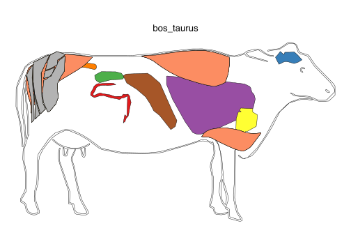
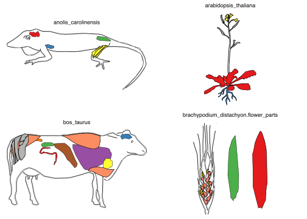
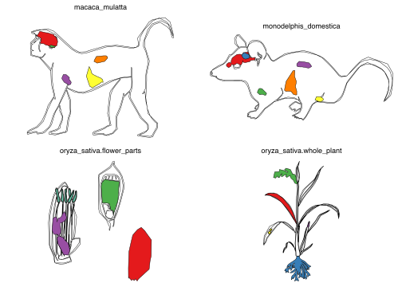

<!-- README.md is generated from README.Rmd. Please edit that file -->
gganatogram
-----------

[](https://ci.appveyor.com/project/jespermaag/gganatogram) [](https://travis-ci.com/jespermaag/gganatogram) [](https://doi.org/10.5281/zenodo.1434233)

Create anatogram images for different organisms. <br/> This package uses the tissue coordinates from the figure in Expression Atlas. <https://www.ebi.ac.uk/gxa/home> <br/> <https://github.com/ebi-gene-expression-group/anatomogram> <br/>

Citation
--------

#### Maag JLV. gganatogram: An R package for modular visualisation of anatograms and tissues based on ggplot2 \[version 1; referees: awaiting peer review\]. F1000Research 2018, 7:1576 (doi: 10.12688/f1000research.16409.1)

<https://f1000research.com/articles/7-1576/v1>

``` r
citation("gganatogram")
#> 
#> Maag J (2018). "gganatogram: An R package for modular
#> visualisation of anatograms and tissues based on ggplot2."
#> _f1000research_. Version 1: Awaiting peer review, <URL:
#> https://f1000research.com/articles/7-1576/v1>.
#> 
#> A BibTeX entry for LaTeX users is
#> 
#>   @Article{,
#>     title = {gganatogram:  An R package for modular visualisation of anatograms and tissues based on ggplot2},
#>     author = {Jesper Maag},
#>     journal = {f1000research},
#>     year = {2018},
#>     note = {Version 1: Awaiting peer review},
#>     url = {https://f1000research.com/articles/7-1576/v1},
#>   }
```

If you use gganatogram please cite Expression Atlas as well. <br/> [Petryszak et al. 2015](https://academic.oup.com/nar/article/44/D1/D746/2502589) <br/> Petryszak, Robert, Maria Keays, Y. Amy Tang, Nuno A. Fonseca, Elisabet Barrera, Tony Burdett, Anja Füllgrabe et al. "Expression Atlas update—an integrated database of gene and protein expression in humans, animals and plants." Nucleic acids research 44, no. D1 (2015): D746-D752.

More plot examples can be found at <https://jespermaag.github.io/blog/2018/gganatogram/>

Install
-------

Install from github using devtools.

``` r
## install from Github
devtools::install_github("jespermaag/gganatogram")
```

Usage
-----

This package requires `ggplot2` and `ggpolypath` which loads when loading the package

``` r

library(gganatogram)
library(dplyr)
```

Available organisms

``` r
library(gridExtra)
hgMale <- gganatogram(data=hgMale_key, fillOutline='#a6bddb', organism='human', sex='male', fill="colour") + theme_void()
hgFemale <- gganatogram(data=hgFemale_key, fillOutline='#a6bddb', organism='human', sex='female', fill="colour") + theme_void()
mmMale <- gganatogram(data=mmMale_key, fillOutline='#a6bddb', organism='mouse', sex='male', fill="colour") + theme_void()
mmFemale <- gganatogram(data=mmFemale_key, outline = T, fillOutline='#a6bddb', organism='mouse', sex='female', fill="colour")  +theme_void()  

grid.arrange(hgMale, hgFemale, mmMale, mmFemale, ncol=4)
```


In order to use the function gganatogram, you need to have a data frame with organ, colour, and value if you want to.

``` r
organPlot <- data.frame(organ = c("heart", "leukocyte", "nerve", "brain", "liver", "stomach", "colon"), 
 type = c("circulation", "circulation",  "nervous system", "nervous system", "digestion", "digestion", "digestion"), 
 colour = c("red", "red", "purple", "purple", "orange", "orange", "orange"), 
 value = c(10, 5, 1, 8, 2, 5, 5), 
 stringsAsFactors=F)

 head(organPlot)
#>       organ           type colour value
#> 1     heart    circulation    red    10
#> 2 leukocyte    circulation    red     5
#> 3     nerve nervous system purple     1
#> 4     brain nervous system purple     8
#> 5     liver      digestion orange     2
#> 6   stomach      digestion orange     5
```

Using the function gganatogram with the filling the organs based on colour.

``` r
gganatogram(data=organPlot, fillOutline='#a6bddb', organism='human', sex='male', fill="colour")
```


Of course, we can use the ggplot themes and functions to adjust the plots

``` r
gganatogram(data=organPlot, fillOutline='#a6bddb', organism='human', sex='male', fill="colour") + 
theme_void()
```


We can also plot all tissues available using hgMale\_key

``` r
hgMale_key$organ
#>  [1] "thyroid_gland"             "bone_marrow"              
#>  [3] "frontal_cortex"            "prefrontal_cortex"        
#>  [5] "pituitary_gland"           "aorta"                    
#>  [7] "gastroesophageal_junction" "left_ventricle"           
#>  [9] "caecum"                    "ileum"                    
#> [11] "rectum"                    "nose"                     
#> [13] "breast"                    "tongue"                   
#> [15] "left_atrium"               "pulmonary_valve"          
#> [17] "mitral_valve"              "penis"                    
#> [19] "nasal_pharynx"             "spinal_cord"              
#> [21] "throat"                    "tricuspid_valve"          
#> [23] "diaphragm"                 "liver"                    
#> [25] "stomach"                   "spleen"                   
#> [27] "duodenum"                  "gall_bladder"             
#> [29] "pancreas"                  "colon"                    
#> [31] "small_intestine"           "appendix"                 
#> [33] "smooth_muscle"             "urinary_bladder"          
#> [35] "bone"                      "cartilage"                
#> [37] "esophagus"                 "salivary_gland"           
#> [39] "parotid_gland"             "submandibular_gland"      
#> [41] "skin"                      "pleura"                   
#> [43] "brain"                     "heart"                    
#> [45] "adrenal_gland"             "lymph_node"               
#> [47] "adipose_tissue"            "skeletal_muscle"          
#> [49] "leukocyte"                 "temporal_lobe"            
#> [51] "atrial_appendage"          "coronary_artery"          
#> [53] "hippocampus"               "vas_deferens"             
#> [55] "seminal_vesicle"           "epididymis"               
#> [57] "tonsil"                    "lung"                     
#> [59] "amygdala"                  "trachea"                  
#> [61] "bronchus"                  "nerve"                    
#> [63] "cerebellum"                "cerebellar_hemisphere"    
#> [65] "kidney"                    "renal_cortex"             
#> [67] "testis"                    "prostate"
gganatogram(data=hgMale_key, fillOutline='#a6bddb', organism='human', sex='male', fill="colour") +theme_void()
```


We can also skip plotting the outline of the graph

``` r
organPlot %>%
    dplyr::filter(type %in% c('circulation', 'nervous system')) %>%
gganatogram(outline=F, fillOutline='#a6bddb', organism='human', sex='male', fill="colour") + 
theme_void()
```


We can fill the tissues based on the values given to each organ

``` r
gganatogram(data=organPlot, fillOutline='#a6bddb', organism='human', sex='male', fill="value") + 
theme_void() +
scale_fill_gradient(low = "white", high = "red")
```


We can also use facet\_wrap to compare groups.
First create add two data frames together with different values and the conditions in the type column

``` r
compareGroups <- rbind(data.frame(organ = c("heart", "leukocyte", "nerve", "brain", "liver", "stomach", "colon"), 
  colour = c("red", "red", "purple", "purple", "orange", "orange", "orange"), 
 value = c(10, 5, 1, 8, 2, 5, 5), 
 type = rep('Normal', 7), 
 stringsAsFactors=F),
 data.frame(organ = c("heart", "leukocyte", "nerve", "brain", "liver", "stomach", "colon"), 
  colour = c("red", "red", "purple", "purple", "orange", "orange", "orange"), 
 value = c(5, 5, 10, 8, 2, 5, 5), 
 type = rep('Cancer', 7), 
 stringsAsFactors=F))
```

``` r
gganatogram(data=compareGroups, fillOutline='#a6bddb', organism='human', sex='male', fill="value") + 
theme_void() +
facet_wrap(~type) +
scale_fill_gradient(low = "white", high = "red") 
```


You can also split the tissues into types while retaining the outline

``` r
gganatogram(data=hgMale_key, outline = T, fillOutline='#a6bddb', organism='human', sex='male', fill="colour") +
facet_wrap(~type, ncol=4) +
theme_void()
```


Added female option
-------------------

All female tissues

``` r
hgFemale_key$organ
#>  [1] "pancreas"                  "liver"                    
#>  [3] "colon"                     "bone_marrow"              
#>  [5] "urinary_bladder"           "stomach"                  
#>  [7] "duodenum"                  "esophagus"                
#>  [9] "gall_bladder"              "spleen"                   
#> [11] "small_intestine"           "placenta"                 
#> [13] "endometrium"               "vagina"                   
#> [15] "aorta"                     "pituitary_gland"          
#> [17] "gastroesophageal_junction" "caecum"                   
#> [19] "appendix"                  "ileum"                    
#> [21] "left_atrium"               "left_ventricle"           
#> [23] "pulmonary_valve"           "mitral_valve"             
#> [25] "diaphragm"                 "bone"                     
#> [27] "cartilage"                 "throat"                   
#> [29] "rectum"                    "nasal_septum"             
#> [31] "nasal_pharynx"             "cerebellum"               
#> [33] "cerebellar_hemisphere"     "prefrontal_cortex"        
#> [35] "frontal_cortex"            "nose"                     
#> [37] "temporal_lobe"             "cerebral_cortex"          
#> [39] "kidney"                    "renal_cortex"             
#> [41] "coronary_artery"           "tricuspid_valve"          
#> [43] "thyroid_gland"             "skin"                     
#> [45] "parotid_gland"             "adipose_tissue"           
#> [47] "heart"                     "smooth_muscle"            
#> [49] "brain"                     "adrenal_gland"            
#> [51] "lymph_node"                "skeletal_muscle"          
#> [53] "ovary"                     "leukocyte"                
#> [55] "salivary_gland"            "fallopian_tube"           
#> [57] "uterus"                    "uterine_cervix"           
#> [59] "nerve"                     "atrial_appendage"         
#> [61] "ectocervix"                "hippocampus"              
#> [63] "pleura"                    "bronchus"                 
#> [65] "trachea"                   "lung"                     
#> [67] "tonsil"                    "submandibular_gland"      
#> [69] "breast"                    "spinal_cord"
gganatogram(data=hgFemale_key, outline = T, fillOutline='#a6bddb', organism='human', sex='female', fill="colour")  +theme_void()
```


You can also split the tissues into types while retaining the outline

``` r
gganatogram(data=hgFemale_key, outline = T, fillOutline='#a6bddb', organism='human', sex='female', fill="colour") +
facet_wrap(~type, ncol=4) +
theme_void()
```


To display the female reproductive system with outline.

``` r
hgFemale_key %>%
    dplyr::filter(type=='reproductive') %>%
    gganatogram( outline = T, fillOutline='#a6bddb', organism='human', sex='female', fill="colour")  +
    theme_void()  +
    coord_cartesian(xlim = c(30, 75), ylim = c(-110, -80))
```


Added mouse
===========

Male
----

``` r
mmMale_key$organ
#>  [1] "aorta"                     "brown_adipose_tissue"     
#>  [3] "stomach"                   "duodenum"                 
#>  [5] "pancreas"                  "spleen"                   
#>  [7] "adrenal_gland"             "kidney"                   
#>  [9] "colon"                     "small_intestine"          
#> [11] "caecum"                    "jejunum"                  
#> [13] "ileum"                     "esophagus"                
#> [15] "gall_bladder"              "lymph_node"               
#> [17] "seminal_vesicle"           "penis"                    
#> [19] "femur"                     "bone_marrow"              
#> [21] "cartilage"                 "quadriceps_femoris"       
#> [23] "spinal_cord"               "lung"                     
#> [25] "diaphragm"                 "trachea"                  
#> [27] "hindlimb"                  "trigeminal_nerve"         
#> [29] "sciatic_nerve"             "intestinal_mucosa"        
#> [31] "liver"                     "heart"                    
#> [33] "brain"                     "skeletal_muscle"          
#> [35] "circulatory_system"        "blood_vessel"             
#> [37] "skin"                      "prostate_gland"           
#> [39] "vas_deferens"              "epididymis"               
#> [41] "testis"                    "urinary_bladder"          
#> [43] "thymus"                    "peripheral_nervous_system"
#> [45] "eye"
gganatogram(data=mmMale_key, outline = T, fillOutline='#a6bddb', organism='mouse', sex='male', fill="colour")  +theme_void()  
```


``` r

gganatogram(data=mmMale_key, outline = T, fillOutline='#a6bddb', organism='mouse', sex='male', fill="colour")  +theme_void()+facet_wrap(~type, ncol=4)
```


Female
------

``` r
mmFemale_key$organ
#>  [1] "aorta"                     "circulatory_system"       
#>  [3] "brown_adipose_tissue"      "stomach"                  
#>  [5] "duodenum"                  "pancreas"                 
#>  [7] "spleen"                    "adrenal_gland"            
#>  [9] "kidney"                    "colon"                    
#> [11] "small_intestine"           "caecum"                   
#> [13] "jejunum"                   "ileum"                    
#> [15] "esophagus"                 "gall_bladder"             
#> [17] "vagina"                    "uterus"                   
#> [19] "urinary_bladder"           "tongue"                   
#> [21] "Peyer's_patch"             "femur"                    
#> [23] "bone_marrow"               "cartilage"                
#> [25] "quadriceps_femoris"        "skeletal_muscle"          
#> [27] "spinal_cord"               "diaphragm"                
#> [29] "hindlimb"                  "trigeminal_nerve"         
#> [31] "eye"                       "intestinal_mucosa"        
#> [33] "brain"                     "heart"                    
#> [35] "liver"                     "sciatic_nerve"            
#> [37] "blood_vessel"              "skin"                     
#> [39] "mammary_gland"             "title8178"                
#> [41] "reproductive_system"       "lymph_node"               
#> [43] "thymus"                    "thyroid_gland"            
#> [45] "lung"                      "peripheral_nervous_system"
#> [47] "trachea"
gganatogram(data=mmFemale_key, outline = T, fillOutline='#a6bddb', organism='mouse', sex='female', fill="colour")  +theme_void()  
```


``` r

gganatogram(data=mmFemale_key, outline = T, fillOutline='#a6bddb', organism='mouse', sex='female', fill="colour")  +theme_void()+facet_wrap(~type, ncol=4)
```


Other organisms i.e. tier 2 organisms
-------------------------------------

Expression atlas contains other organisms than human and mice, however, these are not as well anotated. <br/> All the expression atlas anatograms can be found here <https://ebi-gene-expression-group.github.io/anatomogram/> <br/> Unfortunately, I won't be able to add other organs to these since I'm neither an anatomist nor artist. <br/> If anyone would like to add more organs, I would love for you to contribute. <br/> <br/> To create these plots, I have added two other objects other\_key and other\_list. <br/> These are lists within lists, and to plot all the organs from an organisms use other\_key\[\["organism"\]\] as data, and "organism" as organism. <br/> Also, the organ names are so far a mix of UBERON and plant ids.

``` r
length(other_key)
#> [1] 24
names(other_key)
#>  [1] "anolis_carolinensis"                 
#>  [2] "arabidopsis_thaliana"                
#>  [3] "bos_taurus"                          
#>  [4] "brachypodium_distachyon.flower_parts"
#>  [5] "brachypodium_distachyon.whole_plant" 
#>  [6] "gallus_gallus"                       
#>  [7] "hordeum_vulgare.flower_parts"        
#>  [8] "hordeum_vulgare.whole_plant"         
#>  [9] "macaca_mulatta"                      
#> [10] "monodelphis_domestica"               
#> [11] "oryza_sativa.flower_parts"           
#> [12] "oryza_sativa.whole_plant"            
#> [13] "papio_anubis"                        
#> [14] "rattus_norvegicus"                   
#> [15] "solanum_lycopersicum.flower_parts"   
#> [16] "solanum_lycopersicum.whole_plant"    
#> [17] "sorghum_bicolor.flower_parts"        
#> [18] "sorghum_bicolor.whole_plant"         
#> [19] "tetraodon_nigroviridis"              
#> [20] "triticum_aestivum.flower_parts"      
#> [21] "triticum_aestivum.whole_plant"       
#> [22] "xenopus_tropicalis"                  
#> [23] "zea_mays.flower_parts"               
#> [24] "zea_mays.whole_plant"

length(other_list)
#> [1] 27
names(other_list)
#>  [1] "anolis_carolinensis"                 
#>  [2] "arabidopsis_thaliana"                
#>  [3] "bos_taurus"                          
#>  [4] "brachypodium_distachyon.flower_parts"
#>  [5] "brachypodium_distachyon.whole_plant" 
#>  [6] "gallus_gallus"                       
#>  [7] "homo_sapiens.brain"                  
#>  [8] "hordeum_vulgare.flower_parts"        
#>  [9] "hordeum_vulgare.whole_plant"         
#> [10] "macaca_mulatta"                      
#> [11] "monodelphis_domestica"               
#> [12] "mus_musculus.brain"                  
#> [13] "oryza_sativa.flower_parts"           
#> [14] "oryza_sativa.whole_plant"            
#> [15] "papio_anubis"                        
#> [16] "rattus_norvegicus"                   
#> [17] "solanum_lycopersicum.flower_parts"   
#> [18] "solanum_lycopersicum.whole_plant"    
#> [19] "solanum_tuberosum"                   
#> [20] "sorghum_bicolor.flower_parts"        
#> [21] "sorghum_bicolor.whole_plant"         
#> [22] "tetraodon_nigroviridis"              
#> [23] "triticum_aestivum.flower_parts"      
#> [24] "triticum_aestivum.whole_plant"       
#> [25] "xenopus_tropicalis"                  
#> [26] "zea_mays.flower_parts"               
#> [27] "zea_mays.whole_plant"
```

To plot bos\_taurus use the following command. Unfortunately, I have not managed to add the correct names yet.

``` r
other_key[["bos_taurus"]]
#>             organ  type  colour     value
#> 2        duodenum other #E41A1C 11.381132
#> 3           brain other #377EB8  2.264810
#> 4          kidney other #4DAF4A  4.131599
#> 5            lung other #984EA3  3.182946
#> 6           colon other #FF7F00  3.114481
#> 7           heart other #FFFF33 13.141334
#> 8           liver other #A65628 17.251310
#> 9  pulmonary vein other #F781BF 13.414659
#> 19 UBERON_0001013 other #999999 12.126515
#> 20 UBERON_0001013 other #66C2A5  1.898023
#> 21 UBERON_0001013 other #FC8D62 19.290389
#> 22 UBERON_0014892 other #8DA0CB 10.994221
#> 23 UBERON_0014892 other #E78AC3 16.761115
#> 24 UBERON_0014892 other #A6D854  2.468627
#> 25 UBERON_0014892 other #FFD92F  1.556285
#> 26 UBERON_0014892 other #E5C494  3.461740
#> 27 UBERON_0014892 other #B3B3B3 18.595027

gganatogram(data=other_key[["bos_taurus"]], outline = T, fillOutline='white', organism="bos_taurus", sex='female', fill="colour")  +
        theme_void() +
        ggtitle("bos_taurus") + 
        theme(plot.title = element_text(hjust=0.5)) + 
        coord_fixed()
```



Here is a way to loop through all the other organisms and plot their organs.

``` r
library(gridExtra)
plotList <- list()
for (organism in names(other_key)) {
    plotList[[organism]] <- gganatogram(data=other_key[[organism]], outline = T, fillOutline='white', organism=organism, sex='female', fill="colour")  +
                theme_void() +
                ggtitle(organism) + 
                theme(plot.title = element_text(hjust=0.5, size=9)) + 
                coord_fixed()
}

do.call(grid.arrange,  c(plotList[1:4], ncol=2))
```



``` r

do.call(grid.arrange,  c(plotList[5:8], ncol=2))
```


``` r

do.call(grid.arrange,  c(plotList[9:12], ncol=2))
```



``` r

do.call(grid.arrange,  c(plotList[13:16], ncol=2))
```


``` r

do.call(grid.arrange,  c(plotList[17:20], ncol=2))
```


``` r

do.call(grid.arrange,  c(plotList[21:24], ncol=2))
```


